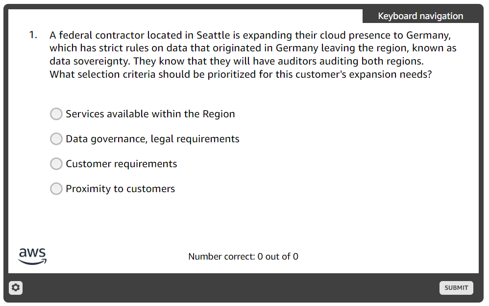

# KC - Assessment Scenario Certification Preparation

## Questions && Answers
1. 

- > Correct Answer:
- ***Data governance, legal requirements***
- Data sovereignty is a legal requirement specific to Germany, focusing on compliance with regional regulations like the GDPR (General Data Protection Regulation). The priority in this scenario is to ensure that the cloud infrastructure adheres to these legal and governance requirements to avoid penalties and ensure proper data handling during audits.

**Incorrect Answers and Why:**
- Services available within the Region

Why it’s incorrect:
While having services available is important, it does not directly address the critical issue of compliance with legal and data governance requirements. Services can exist in a region but still fail to meet the legal criteria required for data sovereignty.

- Customer requirements

Why it’s incorrect:
Customer requirements might include various factors like performance, support, or customization, but these are secondary to complying with the legal mandate of data sovereignty.

- Proximity to customers

Why it’s incorrect:
Proximity can be important for reducing latency or improving service delivery, but it has no bearing on compliance with the legal and governance rules, which is the primary concern in this scenario.

2. 

- > Correct Answers:

>> AWS Identity and Access Management (IAM)

>> Amazon CloudFront

>> Amazon Route 53

- Justifications:

>> AWS Identity and Access Management (IAM)

Why it’s correct:
IAM is a global service. Its configuration and management are not tied to a specific region. IAM policies, roles, and users can be accessed and used across all regions.

>> Amazon CloudFront

Why it’s correct:
CloudFront is a global content delivery network (CDN) service. It distributes content across edge locations worldwide, not tied to any single region, making it a global service.

>> Amazon Route 53

Why it’s correct:
Route 53 is a global DNS service. It manages domain names globally and routes traffic across multiple AWS regions and on-premises resources, making it inherently global.

- N/B: Summary:
The correct global services are IAM, CloudFront, and Route 53, as they operate across regions. The incorrect options (AMIs and EC2) are regional services and must be explicitly configured or replicated to support multi-region operations.

3. 

- > Amazon CloudFront

- Justification:
- Why this is correct:
Amazon CloudFront is a content delivery network (CDN) that caches static content like images at edge locations around the globe. When a user requests content, CloudFront serves it from the nearest edge location, reducing latency and improving download speeds for global customers.

- N/B: Summary:
- The correct service for reducing latency in this scenario is Amazon CloudFront, as it provides efficient global caching and delivery for static content like images. The other options focus on storage and compute rather than optimizing content delivery to a global audience.

4. 

- > Correct Answer:

- Amazon Simple Storage Service (Amazon S3)
- Justification:
- Why this is correct:
Amazon S3 is an ideal service for storing static assets like images due to its durability, scalability, and high availability. It allows administrators to easily update images monthly and serves as a backend storage solution that can integrate with Amazon CloudFront for global delivery. S3 is specifically designed for storing and retrieving objects, making it perfect for hosting website content.

N/B: The images for the website should be stored in Amazon S3 because it is a scalable and efficient object storage solution. Other options, like EBS and Glacier, do not meet the requirements for website image hosting, and CloudFront, while useful, is not a storage solution but a delivery mechanism.

5. 

- > Correct Answer:
- **Table**

- Justification:
- Why it’s correct:
The Table output format in AWS CLI provides a clean, structured, and visually appealing layout that is easy for humans to read and understand. This format is specifically designed for presenting data in a way that is digestible for non-technical users, making it ideal for customer-facing scenarios.

N/B: The Table format is the best choice for presenting AWS CLI results to customers because it prioritizes readability and structure. JSON and Text are better suited for technical tasks, while "Command" is invalid.

6. 

- > Correct Answer:
- **--dry-run**

- Justification:
- --dry-run is used to simulate the execution of an AWS CLI command without actually performing the action. This checks for required permissions and ensures that the user has the necessary access to carry out the operation. If permissions are missing, the CLI returns an error, making it a critical tool for permission verification.

N/B: The --dry-run option is the correct choice because it provides a way to validate permissions before executing an AWS CLI command. The other options (--query, --output, --filter) deal with formatting or filtering data and are unrelated to permission checks.

7. 

- > Correct Answers:

>> Amazon Simple Notification Service (Amazon SNS)

>> AWS Lambda

- Justification:

- **Amazon Simple Notification Service (SNS)**
- Why it’s correct:
SNS is a fully managed messaging service that can send notifications to multiple recipients via various protocols (e.g., SMS, email, push notifications). It is highly suitable for sending food delivery notifications to both customers and restaurants.

- **AWS Lambda**
- Why it’s correct:
Lambda is a serverless compute service that can execute code in response to triggers (e.g., delivery completion event). It can integrate with SNS to initiate notifications based on the application's logic.

N/B: The correct services for enabling food delivery notifications are Amazon SNS for sending notifications and AWS Lambda for executing the logic to trigger those notifications.

8. 

Correct Answer:
169.254.169.254

Justification:
169.254.169.254
Why it’s correct:
This is the dedicated IP address for the EC2 metadata service in AWS. Applications running on EC2 instances can use this IP to query metadata and user data without requiring an internet connection.

9. 

Correct Answer:
Initialization

Justification:
Initialization
Why it’s correct:
User data scripts run during the initial boot cycle of the instance, specifically during the initialization phase. These scripts can configure software, install updates, or perform other tasks after the instance is started.

10. 

Correct Answer:
On-Demand

Justification:
On-Demand Instances
Why it’s correct:
On-Demand instances allow you to pay for compute capacity by the hour or second without any long-term commitment. This is ideal for someone new to AWS who needs flexibility while learning the platform and understanding their instance requirements.
It is a cost-effective choice for unpredictable workloads or temporary projects, as no upfront payment is needed.

11. 

Correct Answer:
Stop the instance
Start the instance
Justification:
Stop the instance

Stopping the instance releases the underlying hardware associated with it. When the instance is started again, AWS assigns new hardware if the original hardware is unavailable or unsuitable.
Start the instance

After stopping the instance, starting it again ensures the instance is provisioned on new hardware, as stopping releases its prior hardware.

12. 