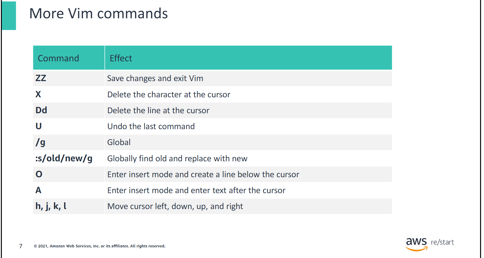
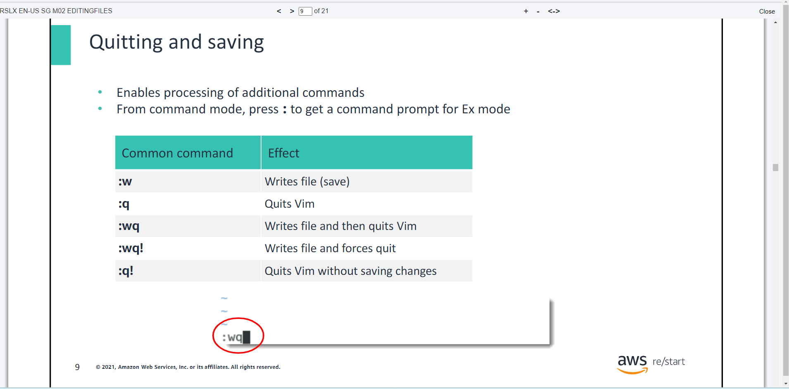
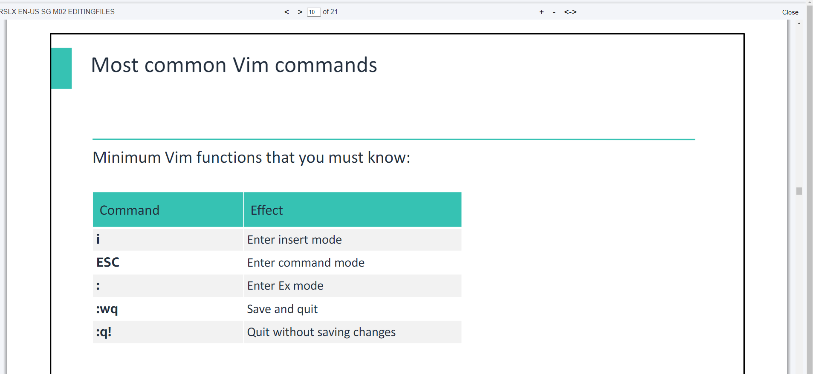
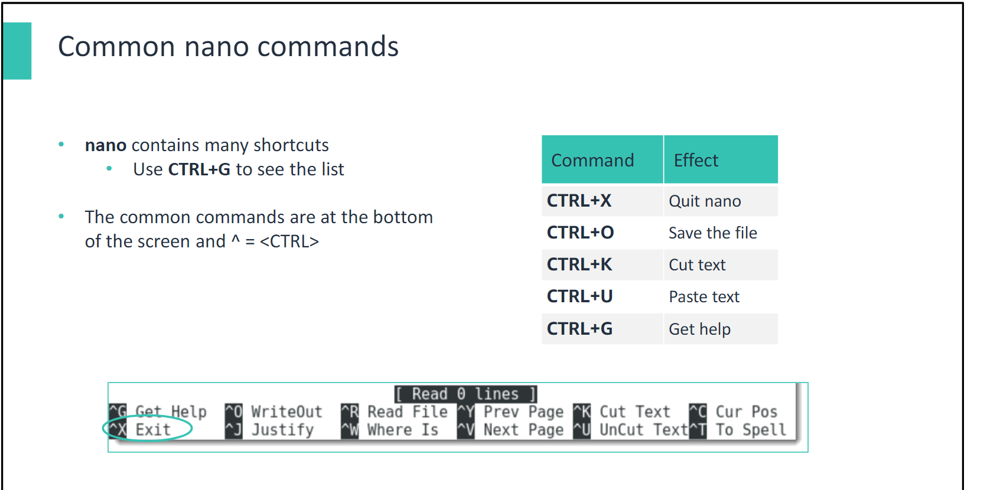

# Linux Command Line & Editing Files in Linux
- ***Day2 Tuesday***

## Linux Fundamentals
- ***You will learn how to:***
- Describe the login workflow
- Explain the Linux command syntax
- Perform basic operations at the command line
- Explain standard input, standard output, and standard error

## Linux login workflow
- ***The login prompt:***
- Enter the user name and password (verified against what the system has on file).
- Access is either granted or denied.

- The user name is checked against the ***/etc/.psswdfile***, which is stored in the /etcdirectory. The file represents an individual user account and contains the following fields separated by colons (:).
1. User name or login name
2. Encrypted password
3. User ID
4. Group ID
5. User description
6. User’s home directory
7. User’s login shell

- ***The login workflow:***
- The user name is checked against the ***/etc/passwd*** file.
- The password is checked against the ***/etc/shadow*** file.

## Linux command prompt
- In this section, you’ll learn about the Linux command prompt.

## Useful commands
- whoami
- id
- hostname
- uptime
- date
- cal
- clear
- echo
- history
- touch
- cat

## Additional commands
- Standard streams are interconnected input and output communication channels. There are three input/output (I/O) streams. The standard streams are #0 Standard in (stdincommand), #1 Standard out (stdoutcommand), and #2 Standard error (stderrcommand). These communication channels handle incoming data or outgoing data from an input device or write data from applications. In modern operating systems, the standard error stream is redirected to log files.

## Standard input –stdincommand
- ***Standard input (stdin)***
- Standard input is the device through which input is normally received: for example, a keyboard or a scanner.

## Standard output –stdoutcommand
- ***Standard output (stdout)***
- Standard output is the device through which output is normally delivered: for example, the display monitor or a mobile device screen.

## Standard error –stderrcommand
- ***Standard error (stderr)***
- Standard error is where a process can write error messages.

## Other Useful Linux Commands
- history
- !xxx where `xxx` is a number for a command shown from the `history` command.

# Editing Files in Linux
- You will learn how to:•Explain basic commands of the Vim file editor•Explain basic commands of the GNU nano file editor•Explain basic commands of the gedit file editor

## Vim text editor
- This section introduces Vim and demonstrates some of the most widely used commands.

## Introduction to Vim
- Vim is the default text editor for nearly all Linux distributions
- Vim is an implementation of Vi. Depending on the Linux distribution, you might find Vi or Vim. A basicunderstanding if this tool is essential.

## Vim modes
- Vim has no menu buttons.
- Vim uses two different modes that react differently to keystrokes.
1. ***Command mode:*** Keystrokes issue commands to Vim.
2. ***Insert mode:*** Keystrokes enter content into the text file.

## The command mode
  ***Keystroke***                ***Effect***
- X                              Delete the character at the cursor
- G                              Move the cursor to the bottom of the file
- gg                             Move the cursor to the top ofthe file
- 42G                            Move the cursor to line 42 of the file
- /keyword                       Search the file for keyword
- y                              Yank text (cut)
- p                              Put text (paste)
- i                              Move to insert mode

## More Vim commands

## The insert mode
- Enters text into body of file
- Press `ESC` to exit insert mode and return to command mode
- Enter `i`.
- Enter your text.
- Press `ESC` to exit the insert mode.

## Quitting and saving

- ***To save the file and exit VIM:***
- Enter `:`
- Enter `wq`

## Most common Vim commands

## GNU nanotext editor
- Common text editor in Linux
- On a Debian or Ubuntu distribution, you can use the following command: `sudo apt-get install nano`

## Common nano commands

