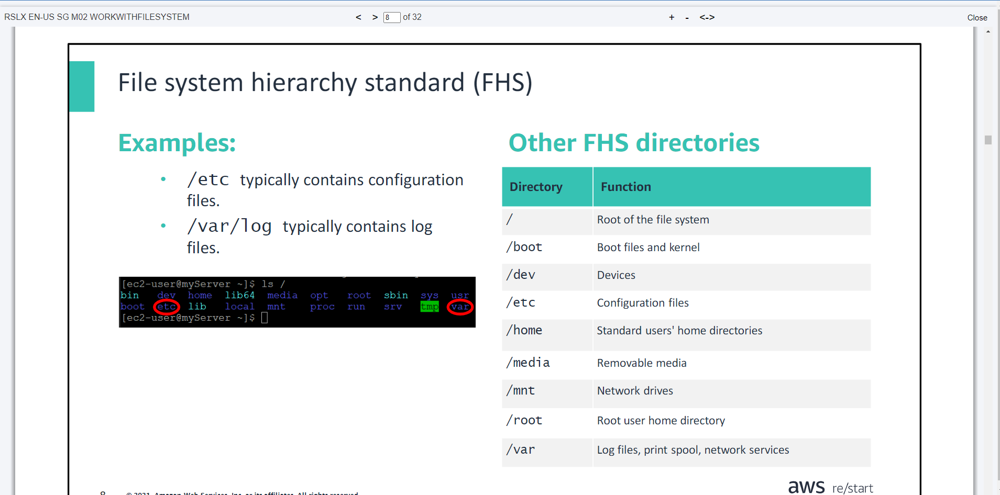
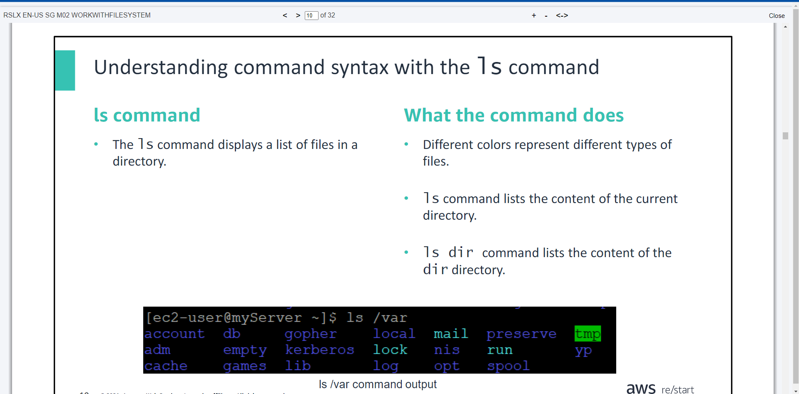

# Linux Users and Groups && Working with the Linux File System
- ***Day 3 Wednesday***

- ***You will learn how to:***
- Manage user accounts
- Manage group accounts
- Elevate permissions by using the suand sudo commands
- Describe AWS Identity and Access Management (IAM), the authentication service that Amazon Web Services (AWS) uses

## Managing users
- In this section, you will learn how to create users and manage their passwords.

## User accounts
- User accounts represent users on the system.
- User information can be stored locally or on another server accessible through a network.
- When information is stored locally, Linux stores it in the **/etc/passwd** file.

```javascript
tail /etc/passwd
```

- `tail` is a command that displays the last lines of a file. By default, it displays the last 10 lines, but you can adjust the number of lines using the `–n` option.
- For example, the following command displays the last five lines:

```javascript
tail –n 5 /etc/passwd
```

## The /etc/passwdfile
- Linux stores the accounts in the `/etc/passwd` file.

## Default user accounts
- Default system accounts are created during the installation of Linux and services.
- For example, a `root` user account is created during the installation, which allows administration of the system.

- `head` is the complementary command of `tail`. It displays the first 10 lines of a file by default.
- You can adjust the number of lines by using the `–n` option:
- For example, the following command displays the first five lines: 

```javascript
head –n 5 /etc/passwd
```

## The `useradd` command
- Creates the user account
- Creates a home directory for the user in `/home`
- Defines account defaults

- `grep` is a command that searches for a string in a file.

## The `usermod` command
- This command is used to modify or change parts of or a whole existing user account. For example:

```javascript
usermod-c "Mary Major" mmajor
```

```javascript
usermod-e 2025-01-01 mmajor
```

## The `userdel` command
- Deletes a user account
- Uses the `-r` option to also delete the user's home directory

```javascript
userdel -r jdoe
```

## The `passwd` command
- User passwords are set with the `passwd` command
- You must enter the password twice
- Users can reset their own passwords, and the root user can reset any user password
- No characters are echoed to the screen when the password is set.

```javascript
passwd mmajor
```

## Managing groups
- A group is a set of accounts
- The storage location for groups is the `/etc/group` file.

## IAM
## AWS Identity and Access Management (IAM)
- `IAM` is an AWS service that is used to manage users and access to resources
- You can create users, groups, and rolesand apply policiesto control access to resources
- Access to IAM can be done through:

>> AWS Management Console, a web interface via a browser

>> AWS Command Line Interface (AWS CLI), a command line interface accessible by using a Linux shell or Windows command line

>> AWS software development kits (SDKs) available for manylanguages, including Java, Python, JavaScript

## A Snapshot Of AWS Management Console


# Working with the Linux File System
- ***You will learn how to:***
- Navigate files and directories in Linux
- Explain basic commands for managing files and directories
- Compare absolute and relative paths

## Navigating files and directories
- Files allow for transparency. Drives, processes, and other elements are all represented as files. They can be browsed and accessed for information (for example, `ls /proc` gives you access to processes).
- Files allow for interoperability. The same tools can be used for different types of files and can be combined (for example, `ls –l  | grep .txt`).

## File system hierarchy standard (FHS)


## Commands for managing files and directories


## `more` command
- Used to view file contents that don't fit on one screen.
- Loads entire contents of files before displaying results
- Can only scroll down
- Can be used in conjunction with other commands: `cat file.txt | more`
