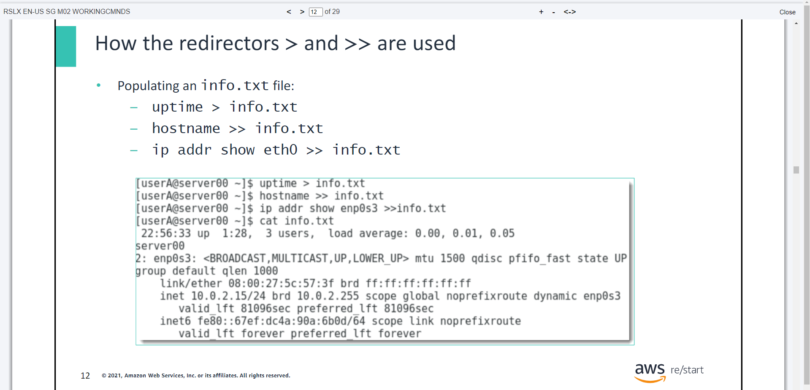
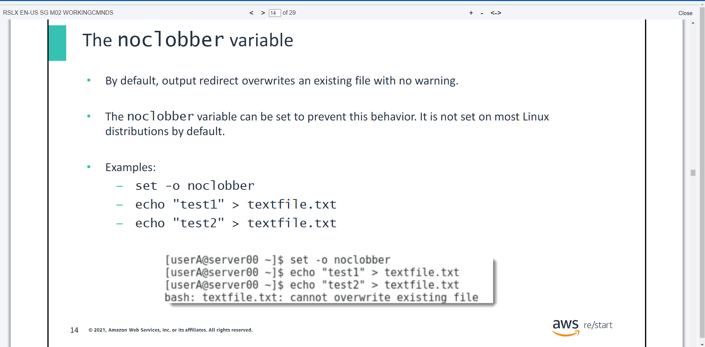
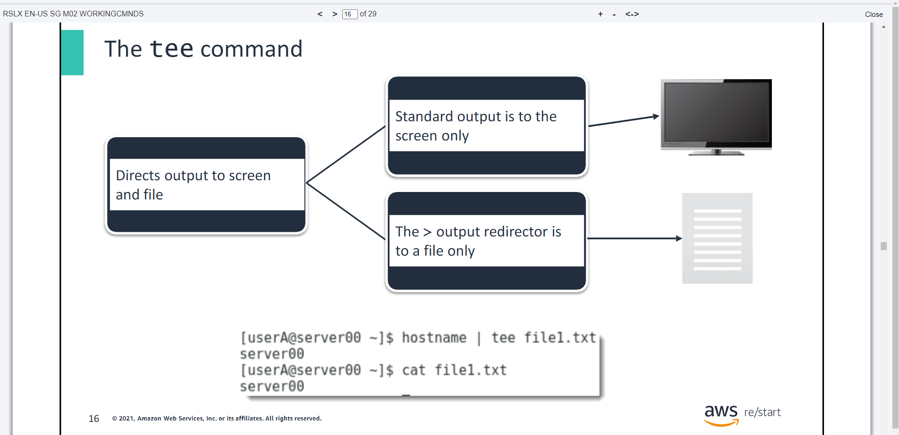
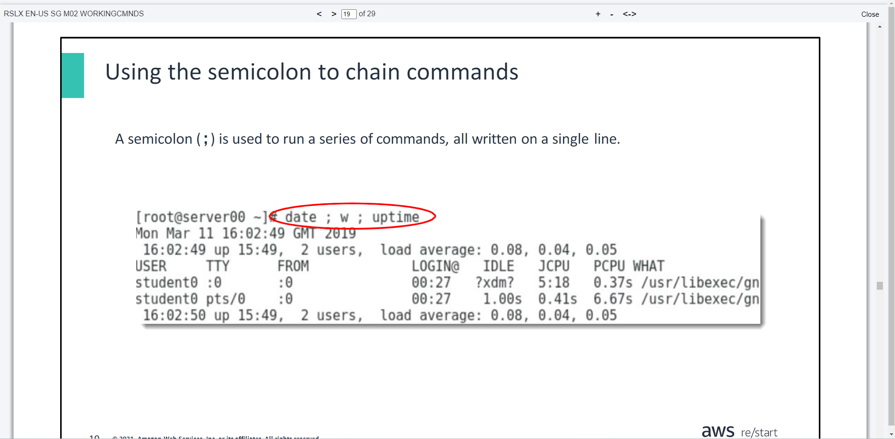

# Working with Linux Commands & Managing Linux Processes

- ***Day 5 Friday***

- ***You will learn how to:***
- Describe the purpose of special characters used with commands in Bash
- Describe commonly used text search and manipulation commands
- Explain redirection and describe common syntax for various redirect options

## Special characters, wildcards, and redirection
- Special characters, wildcards, and redirection are all used with commands in Bash.
- You’ll see use cases for these options.

## Using quotation marks with Bash
- In the Bash shell, a `space` is a delimiter(a separator)
- Example: `usermod -c devuser jdoe`

>> This command adds the comment `devuser` on the `jdoe` line in the `/etc/passwd` file

>> The space separates the two arguments that are passed to the command `usermod`

- To force Bash to recognize the space inside an argument, a value is enclosed in quotation marks (" ")
- Example: `usermod -c "This is a dev user" jdoe`

## Bash metacharacters


- Bash metacharacters are special characters that have a meaning to the shell and that users can use to work faster and more powerful interaction with Bash. They are especially useful when writing scripts.

## Redirection operators


- Alert! By default, the `>` output redirector will overwrite existing file content with no warning.

## How the redirectors `>` and `>>` are used



## The `noclobber` variable



## The `tee` command



## Command substitution, chaining, and filtering
## Command substitution


## Using the semicolon to chain commands



- Chaining commands is similar to writing small scripts. 
- Another example is the following:

```javascript
yum update ; yum install httpd ; systemctl start httpd &  
```

- This command updates packages on the system, installs an Apache HTTP server, and starts it.
- You can use &to run tasks in the background so that you can keep working on the shell.
- Chaining and running tasks in the background can save you a lot of time.

## The `cut` command


## The `sort` command


## The `awk` command


# Managing Linux Processes
- ***You will learn how to:***
- Define a process in Linux
- Describe basic commands for process management
- Compare the atand croncommands for job scheduling

## What is a process?
- A program is a series of instructions given to a computer that tells which actions the computer should take.
- Programs are usually one of two kinds:
1. System programs
2. Application programs
