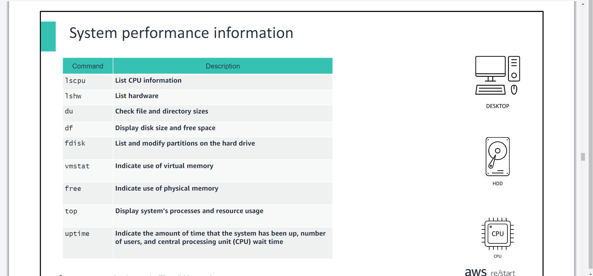
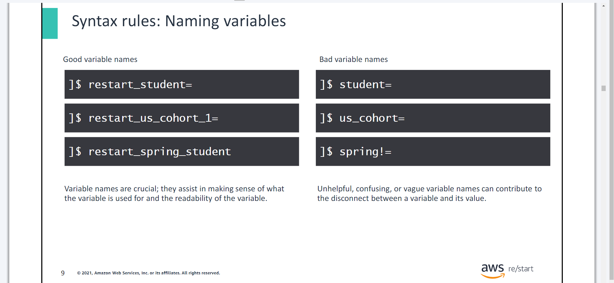

# Managing Linux Services & The Bash Shell & Bash Shell Scripting

- ***Day 1 Monday***

## Managing Services
- ***You will learn how to:***
- Explain common commands that are used for managing services on Linux
- Explain common commands that are used for monitoring services on Linux

## The `systemctl` command
- The `systemctl` command has many subcommands, including `status, start, stop, restart, enable, and disable`.
- Services provide functionality such as networking, remote administration, and security.

## Managing services with the `systemctl` command
- The `sudo systemctl start httpd` command starts the service.
- The `sudo systemctl enable httpd` command activates the service.

## Monitoring on Linux
## System performance information


## Amazon CloudWatch
- AWS CloudWatch monitors the health and performance of your AWS resources and applications.

>> It offers monitoring of Amazon Elastic Compute Cloud (Amazon EC2) instances, such as CPU usage, disk reads, and writes.

>> You can create alarms. For example, when CPU usage exceeds a certain threshold, a notification is sent through Amazon Simple Notification Service (Amazon SNS).


# The Bash Shell
- You will learn how to:

>> Describe features of the Bash shell

>> Explain how to display shell variables

>> Explain how environment variables are used

>> Describe the value of the alias command

## The Bourne Again Shell: Bash shell
- This section defines a Linux shell and introduces the Bash shell.

## The Linux shell
- **What is a shell?**
- A shell accepts and interprets commands.
- A shell is an environment in which commands, programs, and shell scripts are run.
- There are many types of Linux shells available. `Bash` is one of them, and this section discusses it further.
- Bash is the default shell in Linux.
- It offers an efficient environment for interacting with the operating system and scripting.
- `Bash` is a programming language for running commands. Bash is the default shell in Linux operating systems. It is widely used, so some familiarity with Bash is expected in many systems or development roles.

## Shell variables
- This section explains what Bash shell variables are, how to name them,what the rules are for writing them, and how to assign a value to them.

```shell
name=value
```

- In a shell, a variable is used to store values. A variable value can be a string, a number, or special characters; by default, variables are strings.

## Syntax rules: Variable syntax structure

```shell
restart_student=
```

- By convention and as a good practice, the name of a variable that a user has created is in lowercase. Environment (system) variable names are capitalized. Also, there is no space before or after the equal sign.
- There are rules for defining or creating variables in the shell.
- When defining a variable, the variable name must be prefixed with the dollar ($) symbol.
- The variable must contain no spaces or special characters within the variable name. A variable name can contain only letters (a to z or A to Z), numbers (0 to 9), or the underscore character ( _), andthey are usually capitalized (e.g. VARIABLE).

## Syntax rules: Naming variables



## Displaying shell variables
- Display shell variables using the `echo` command:

```shell
echo $VARIABLE_NAME
```

OR

```shell
echo $(VARIABLE_NAME)
```

- To display the value of a variable, use the echo $VARIABLE_NAME. Also use the echocommand to view the output from environmentvariables or system-wide variables.

## Environment variables
```shell
KEY=VALUE
```

- In a shell, environment variables are the same as shell variables. Structurally, these variables are no different from each other. Both use the key-value pair, and they are separated by the equal (=) sign.

## Understanding the Bash environment and `env` command
## The `env` command
- If you run the envcommand without any options, it will display the variables in your current environment. With options, you can use this command to view, set, or remove environment variables.

## The `alias` command
- By using aliases, you can define new commands by substitutinga long command with a short one.
```shell
alias alias_name='command'
```

- By using aliases,you can define new commands by substitutinga long command with a short one. Aliases can be set temporarily in the current shell, but it is more common to set them in the user's .bashrcfile so that they are permanent. In the example, llis often substituted or aliased to ls –l.

## The `unalias` command
- The `unalias` command removes the configured alias if it is not configured in the .bashrc file.
```shell
unalias [alias_name]
```

- Aliases can be added to the .bashrc file.
```shell
nano ~/.bashrc
```


# Bash Shell Scripting
- You will learn how to:

>> Describe common tasks that are accomplished through shell scripts

>> Describe basic commands that are frequently included in shell scripts

>> Describe basic logical control statements that are frequently included in shell scripts

>> Run a shell script
