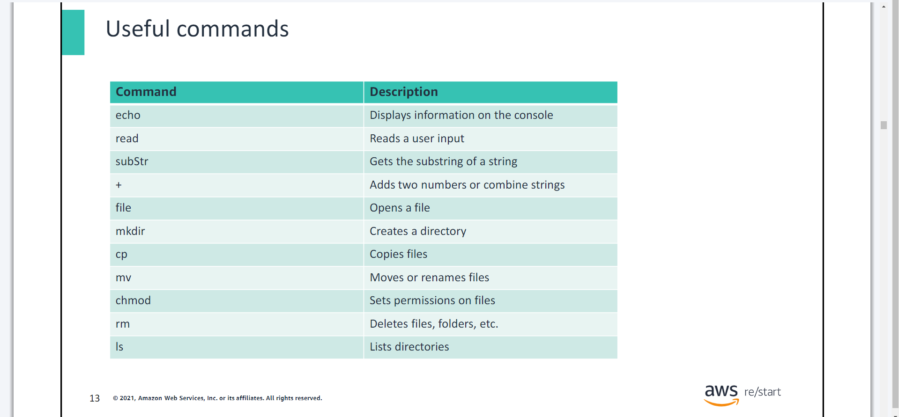
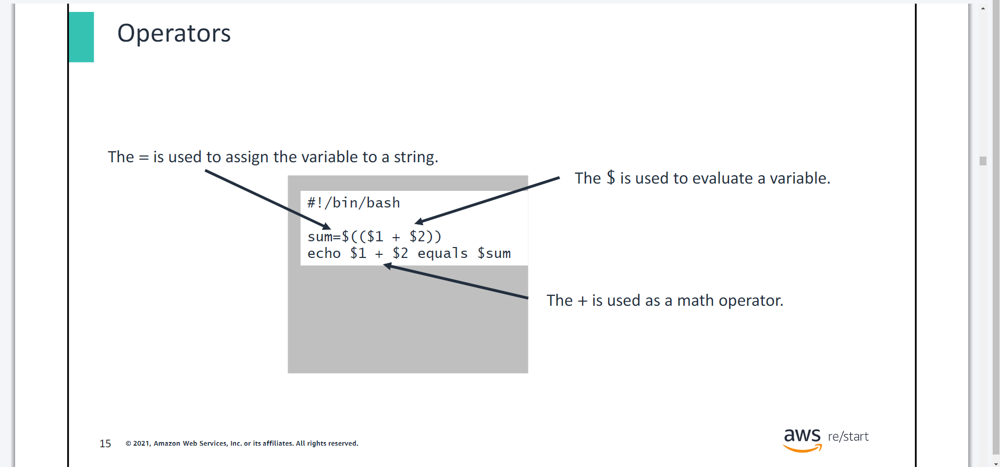
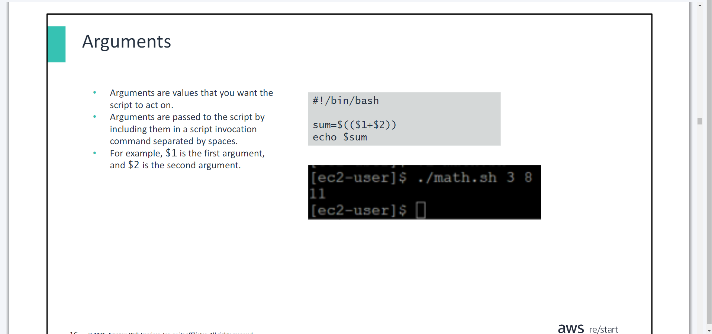
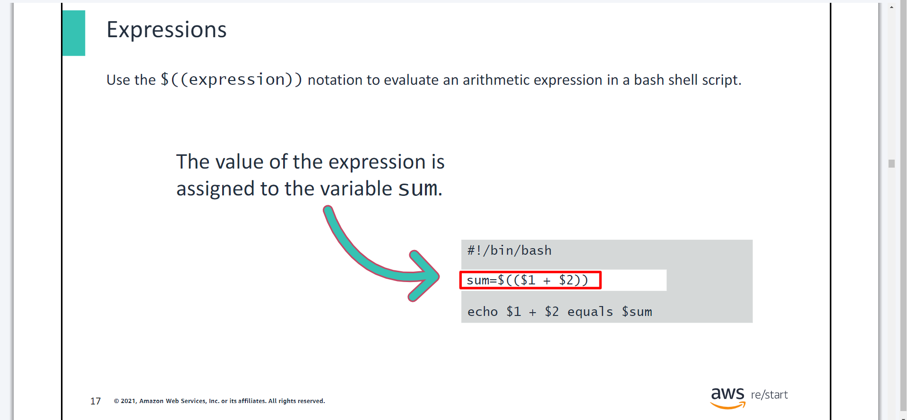
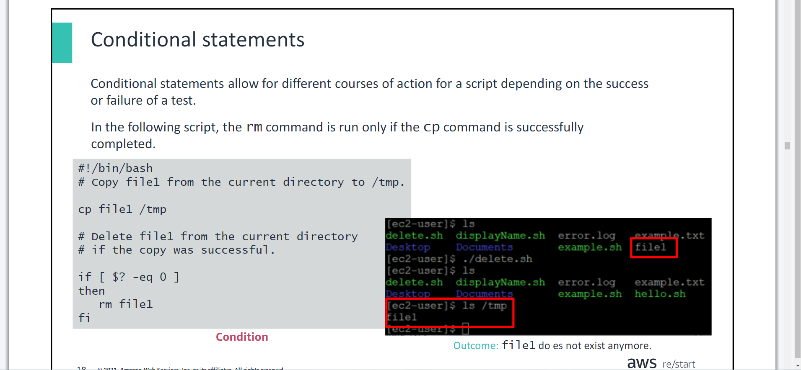

# Managing Linux Services & The Bash Shell & Bash Shell Scripting

- ***Day 1 Monday***

## Managing Services
- ***You will learn how to:***
- Explain common commands that are used for managing services on Linux
- Explain common commands that are used for monitoring services on Linux

## The `systemctl` command
- The `systemctl` command has many subcommands, including `status, start, stop, restart, enable, and disable`.
- Services provide functionality such as networking, remote administration, and security.

## Managing services with the `systemctl` command
- The `sudo systemctl start httpd` command starts the service.
- The `sudo systemctl enable httpd` command activates the service.

## Monitoring on Linux
## System performance information


## Amazon CloudWatch
- AWS CloudWatch monitors the health and performance of your AWS resources and applications.

>> It offers monitoring of Amazon Elastic Compute Cloud (Amazon EC2) instances, such as CPU usage, disk reads, and writes.

>> You can create alarms. For example, when CPU usage exceeds a certain threshold, a notification is sent through Amazon Simple Notification Service (Amazon SNS).


# The Bash Shell
- You will learn how to:

>> Describe features of the Bash shell

>> Explain how to display shell variables

>> Explain how environment variables are used

>> Describe the value of the alias command

## The Bourne Again Shell: Bash shell
- This section defines a Linux shell and introduces the Bash shell.

## The Linux shell
- **What is a shell?**
- A shell accepts and interprets commands.
- A shell is an environment in which commands, programs, and shell scripts are run.
- There are many types of Linux shells available. `Bash` is one of them, and this section discusses it further.
- Bash is the default shell in Linux.
- It offers an efficient environment for interacting with the operating system and scripting.
- `Bash` is a programming language for running commands. Bash is the default shell in Linux operating systems. It is widely used, so some familiarity with Bash is expected in many systems or development roles.

## Shell variables
- This section explains what Bash shell variables are, how to name them,what the rules are for writing them, and how to assign a value to them.

```shell
name=value
```

- In a shell, a variable is used to store values. A variable value can be a string, a number, or special characters; by default, variables are strings.

## Syntax rules: Variable syntax structure

```shell
restart_student=
```

- By convention and as a good practice, the name of a variable that a user has created is in lowercase. Environment (system) variable names are capitalized. Also, there is no space before or after the equal sign.
- There are rules for defining or creating variables in the shell.
- When defining a variable, the variable name must be prefixed with the dollar ($) symbol.
- The variable must contain no spaces or special characters within the variable name. A variable name can contain only letters (a to z or A to Z), numbers (0 to 9), or the underscore character ( _), andthey are usually capitalized (e.g. VARIABLE).

## Syntax rules: Naming variables


## Displaying shell variables
- Display shell variables using the `echo` command:

```shell
echo $VARIABLE_NAME
```

OR

```shell
echo $(VARIABLE_NAME)
```

- To display the value of a variable, use the echo $VARIABLE_NAME. Also use the echocommand to view the output from environmentvariables or system-wide variables.

## Environment variables
```shell
KEY=VALUE
```

- In a shell, environment variables are the same as shell variables. Structurally, these variables are no different from each other. Both use the key-value pair, and they are separated by the equal (=) sign.

## Understanding the Bash environment and `env` command
## The `env` command
- If you run the envcommand without any options, it will display the variables in your current environment. With options, you can use this command to view, set, or remove environment variables.

## The `alias` command
- By using aliases, you can define new commands by substitutinga long command with a short one.
```shell
alias alias_name='command'
```

- By using aliases,you can define new commands by substitutinga long command with a short one. Aliases can be set temporarily in the current shell, but it is more common to set them in the user's .bashrcfile so that they are permanent. In the example, llis often substituted or aliased to ls –l.

## The `unalias` command
- The `unalias` command removes the configured alias if it is not configured in the .bashrc file.
```shell
unalias [alias_name]
```

- Aliases can be added to the .bashrc file.
```shell
nano ~/.bashrc
```


# Bash Shell Scripting
- You will learn how to:

>> Describe common tasks that are accomplished through shell scripts

>> Describe basic commands that are frequently included in shell scripts

>> Describe basic logical control statements that are frequently included in shell scripts

>> Run a shell script

## What is a script/scripts?
- This section defines a script and covers common tasks that you can accomplish by using shell scripts.

>> Scripts are text files of commands and related data.

>> When the text file is processed, the commands are run.

>> Scripts can be set as scheduled tasks by using `cron`.

>> Automation allows scripts to run more quickly than if they are run manually.

>> Scripts are consistent due to automation removing the potential for manual errors. 


- ***Common script tasks:***
- Creating backup jobs
- Archiving log files
- Configuring systems and services
- Simplifying repetitive task
- Automating tasks

## Shell Scripts


- The process of creating a script follows these steps:
1. Create the script using a text editor.
2. Set the script permissions to `run`.
3. Use `./` to run the script.

## Amazon EC2 user data script
- Amazon Elastic Compute Cloud (Amazon EC2) is a virtual compute service.
- Shell scripts can run at creation time to install software on an EC2 instance.

## Basic scripting syntax
- This section introduces basic commands that are frequently included in shell scripts.

## The `#` character
- Bash ignores lines that are preceded with `#`.
- Bash ignores lines that are preceded with `#` .

## #!/bin/bash and #comments
- `#!` is referred to as a shebang.
- The first line defines the interpreter to use (it gives the path and name of the interpreter).
- Scripts must begin with the directive for which shell will run them.
- The location and shell can be different.•Each shell has its own syntax, which tells the system what syntax to expect.

## Script documentation
- Some administrators create a script template, which contains all the relevant information and sections.
- The template might include the following

>> Title

>> Purpose

>> Author’s name and contact information

>> Special instructions or examples

## Useful Commands


## Operators


## Arguments


## Expressions


- Expressions are evaluated and usually assigned to a variable for reference later in the script. 
- In this example, the script:
1. Evaluates the sum of the first two arguments passed to the script.
2. Assigns the result to the sumvariable.
3. Echoes a message showing the value of the arguments and their computed sum.

## Conditional statements


## Logical control statements
- The section focuses on basic logical control statements that are frequently included in shell scripts, such as if, if-else, if-elif-else, and test.

## The `if` statement
- If the first command succeeds with an exit code of 0 (success), then the subsequent command runs.
- This is the simplest conditional statement.
- An `if` statement must end with the `fi` keyword.
- An `if` statement is written as follows: 
```shell
if <condition>
then
<command>
fi
```

Or if writing everything in one line:

```shell
if <condition>; then <command>; fi
```

- Note that the semicolon (;) is required to separate multiple commands on the same line.
- Indentation is used for better readability but is not required

## The `if -else` statement
- An if-else statement is written as follows: 
```shell
if <condition>
then
<command>
else
<other command>
fi
```

## The `if -elif -else` statement
- The example compares two numbers passed as parameters to the script:

>> `gt` means greater than

>> `lt` means lower than

- An if-elif-else statement is written as follows: 
```shell
if <condition>
then
<command>
elif <other condition>
then
<other command>
else
<default  command>
fi
```

## The `test` command
- Checks file types and compare values
- Conditions are tested, and then the test exitswith a 0for true and a 1for false.
- Syntax: test <EXPRESSION>

## Loop statements
- Sections of a script can be configured to repeat themselves.
- The loop can end:

>> After a specific number of repeats (forstatement)

>> Or until a condition is met (untilstatement)

>> Or while a condition is true (whilestatement)
