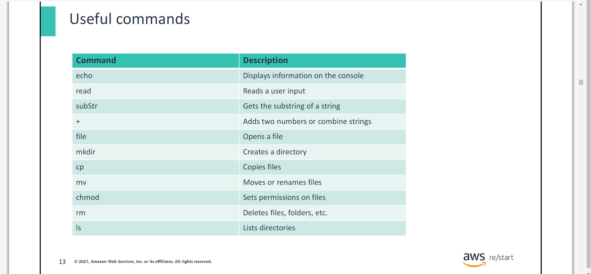
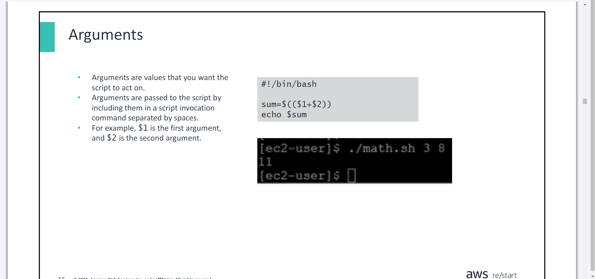

# Bash Shell Scripting & Linux Software Management & Managing Linux Log Files & Introduction to networking
- ***Day 2 Tuesday***

# Bash Shell Scripting
- You will learn how to:

>> Describe common tasks that are accomplished through shell scripts

>> Describe basic commands that are frequently included in shell scripts

>> Describe basic logical control statements that are frequently included in shell scripts

>> Run a shell script

## What is a script/scripts?
- This section defines a script and covers common tasks that you can accomplish by using shell scripts.

>> Scripts are text files of commands and related data.

>> When the text file is processed, the commands are run.

>> Scripts can be set as scheduled tasks by using `cron`.

>> Automation allows scripts to run more quickly than if they are run manually.

>> Scripts are consistent due to automation removing the potential for manual errors. 


- ***Common script tasks:***
- Creating backup jobs
- Archiving log files
- Configuring systems and services
- Simplifying repetitive task
- Automating tasks

## Shell Scripts


- The process of creating a script follows these steps:
1. Create the script using a text editor.
2. Set the script permissions to `run`.
3. Use `./` to run the script.

## Amazon EC2 user data script
- Amazon Elastic Compute Cloud (Amazon EC2) is a virtual compute service.
- Shell scripts can run at creation time to install software on an EC2 instance.

## Basic scripting syntax
- This section introduces basic commands that are frequently included in shell scripts.

## The `#` character
- Bash ignores lines that are preceded with `#`.
- Bash ignores lines that are preceded with `#` .

## #!/bin/bash and #comments
- `#!` is referred to as a shebang.
- The first line defines the interpreter to use (it gives the path and name of the interpreter).
- Scripts must begin with the directive for which shell will run them.
- The location and shell can be different.•Each shell has its own syntax, which tells the system what syntax to expect.

## Script documentation
- Some administrators create a script template, which contains all the relevant information and sections.
- The template might include the following

>> Title

>> Purpose

>> Author’s name and contact information

>> Special instructions or examples

## Useful Commands


## Operators


## Arguments


## Expressions


- Expressions are evaluated and usually assigned to a variable for reference later in the script. 
- In this example, the script:
1. Evaluates the sum of the first two arguments passed to the script.
2. Assigns the result to the sumvariable.
3. Echoes a message showing the value of the arguments and their computed sum.

## Conditional statements


## Logical control statements
- The section focuses on basic logical control statements that are frequently included in shell scripts, such as if, if-else, if-elif-else, and test.

## The `if` statement
- If the first command succeeds with an exit code of 0 (success), then the subsequent command runs.
- This is the simplest conditional statement.
- An `if` statement must end with the `fi` keyword.
- An `if` statement is written as follows: 
```shell
if <condition>
then
<command>
fi
```

Or if writing everything in one line:

```shell
if <condition>; then <command>; fi
```

- Note that the semicolon (;) is required to separate multiple commands on the same line.
- Indentation is used for better readability but is not required

## The `if -else` statement
- An if-else statement is written as follows: 
```shell
if <condition>
then
<command>
else
<other command>
fi
```

## The `if -elif -else` statement
- The example compares two numbers passed as parameters to the script:

>> `gt` means greater than

>> `lt` means lower than

- An if-elif-else statement is written as follows: 
```shell
if <condition>
then
<command>
elif <other condition>
then
<other command>
else
<default  command>
fi
```

## The `test` command
- Checks file types and compare values
- Conditions are tested, and then the test exitswith a 0for true and a 1for false.
- Syntax: test <EXPRESSION>

## Loop statements
- Sections of a script can be configured to repeat themselves.
- The loop can end:

>> After a specific number of repeats (forstatement)

>> Or until a condition is met (untilstatement)

>> Or while a condition is true (whilestatement)

- Looping extends the power and complexity of scripts.

## The `for` statement
- Loops the command a specified number of times
- Bracketed by doand done
- To loop a command a specific number of times, use the for statement.

## The `while` statement
- Continues running the script as long as the specified condition is true
- Bracketed by `while` and `done`

## The `until` statement
- Similar to the `while` statement
- Runs code until a condition becomes true
- Bracketed by untiland done

## Loop control statement: Break


## The `exit` command


# Linux Software Management
- You will learn to:

>> Describe how package managers support software management

## Managing software


## Package managers and packages


## Repositories


## Managing Linux Log Files
- You will learn how to:

>> Define log files

>> Use commands to read different types of messages in a log file

>> Recognize the benefits of log rotation

## What is logging?
- Logs keep records of events on the system, which helps with auditing.
- ***The following are types of logs***:
- System logs (system startupinformationand system shutdowntimes)
- Events logs(user login and logoutevents)
- Applications logs (startup time, actions, and errors)

## The importance of logging


## Logging levels


# Introduction to networking
- ***You will learn how to:***

>> Define basic networking terms

>> Explain what the Internet is, its purpose, and its function for users.

>> Identify the main components of a computer network
