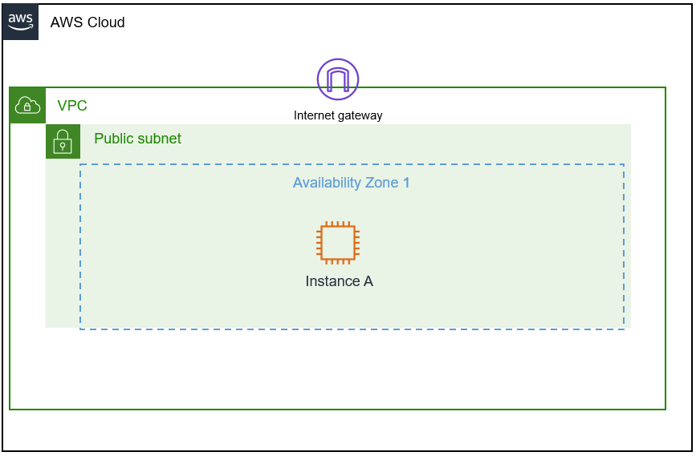

# Static and Dynamic and IP addresses
## Scenario
- Your role is a cloud support engineer at Amazon Web Services (AWS). During your shift, a customer from a Fortune 500 company requests assistance regarding a networking issue within their AWS infrastructure. The email and an attachment of their architecture is below:

- ***Ticket from your customer***
```javascript
Hello Cloud Support!

We are having issues with one of our EC2 instances. The IP changes every time we start and stop this instance called Public Instance. This causes everything to break since it needs a static IP address. We are not sure why the IP changes on this instance to a random IP every time. Can you please investigate? Attached is our architecture. Please let me know if you have any questions.

Thanks!
Bob, Cloud Admin
```

## Architecture diagram


- Figure: Customer VPC architecture, which includes one public subnet and one EC2 instance


## Objectives
- In this lab, you will:

1. Summarize the customer scenario
2. Analyze the difference between a statically and dynamically assigned IP addresses using EC2 instances
3. Assign a persistent (static) IP to an EC2 instance
4. Develop a solution to the customers issue found within this lab; after developing a solution, summarize and describe your findings
