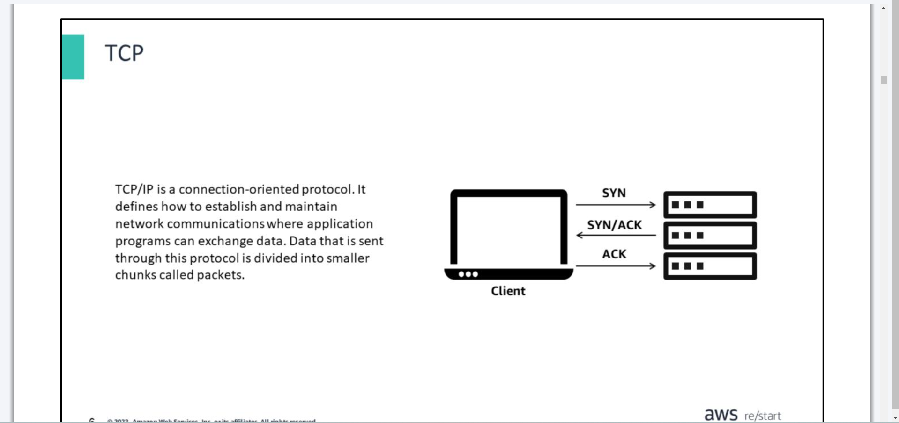
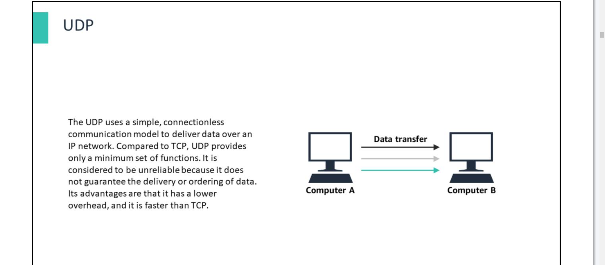
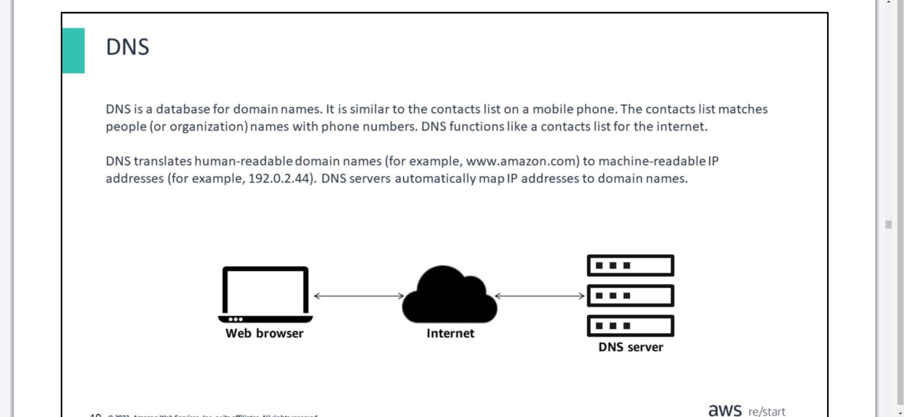
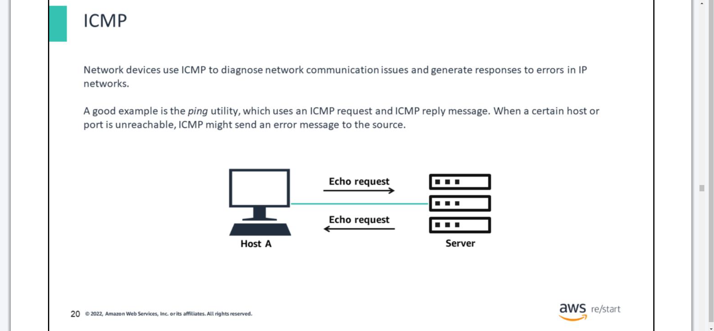

# Additional Networking Protocols
- ***Day 1 Monday***

- You will learn how to:

>> Identify other types of communication protocols

>> Describe common transport, application, and network management protocols

>> Use tools to discover information about network communications

## OSI Model

## TCP

## UDP

## DNS

## ICMP

## 