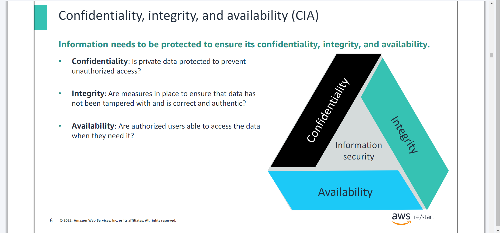

# Introduction to Security && Security Lifecycle: Prevention
- You will learn how to:

>> Define key security terms

>> Identify different types of security threats

>> Identify the components that comprise a security strategy

>> List the types of security controls

>> Name the stages of the security lifecycle

## What is security?
- ***Security is the practice of protecting valuable assets.***
- The primary goal of cybersecurity is to ensure the ***CIA*** Tragiad - `confidentiality`, `integrity`, and `availability` of digital information.

## The CIA Triad

## Basic Security Terms

- Acceptable Use Policy Example

# Security Lifecycle: Prevention
- You will learn how to:

>> Describe the importance of prevention in the security lifecycle

>> Describe security prevention tasks

>> Use a layered model to build a security prevention strategy

>> List different types of prevention measures

## 