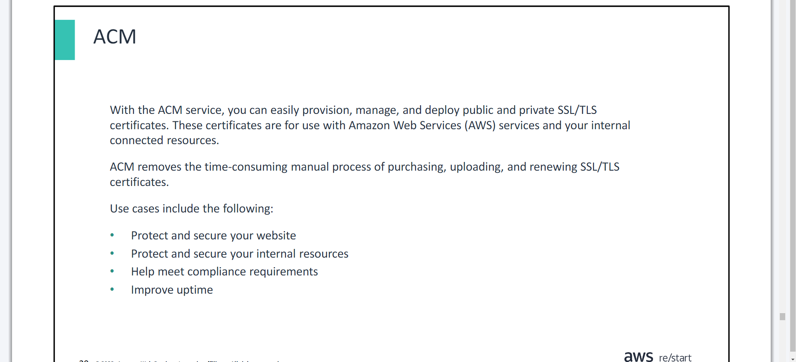

# Data Security && Public Key  && Amazon Certificate Manager (ACM) Demonstration

- ***Day 4 Thursday***

- You will learn how to:

>> Explain encryption techniques that help protect data confidentiality

>> Describe hashing as a method to ensure data integrity

>> Distinguish between discretionary and role-based access control

- Recall that the phases of the security lifecycle consist of the following:

>> `Prevention` – Is the first line of defense

>> `Detection` – Occurs when prevention fails

>> `Response` – Describes what you do when you detect a security threat

>> `Analysis` – Completes the cycle as you identify lessons learned and implement

## Confidentiality, integrity, and availability (CIA)
- Information must be protected to ensure its `confidentiality`, `integrity`, and `availability`.

## Cryptography and encryption
## Cryptography
- `Cryptography` is the discipline that embodies the principles and techniques for providing data security, including confidentiality and data integrity.
- `Encryption` is the process of using a code, called a cipher, to turn readable data into unreadable data for another party. The cipher contains both algorithms to encrypt and to decrypt the data.
- A `key` is a series of numbers and letters that the algorithm uses to encrypt and decrypt data. Only the owners of the keys can encrypt and decrypt data.

- AWS CloudHSM is a cloud-based hardware security module (HSM). You can use CloudHSM to generate and use your own encryption keys on the AWS Cloud.
- With AWS Key Management Service (AWS KMS), you can create and manage cryptographic keys and control their use across a wide range of AWS services and in your applications.

# Public Key Infrastructure
- You will learn how to:

>> Explain how the public key infrastructure (PKI) works and describe its major components

>> Explain how certificates work and how they can be used to secure information

>> Describe certification authorities and their common configurations

## PKI components

## Certificate authorities

## Certificate use cases

## ACM

## Amazon Certificate Manager (ACM) Demonstration

>> Amazon Certificate Manager (ACM) Demonstration
