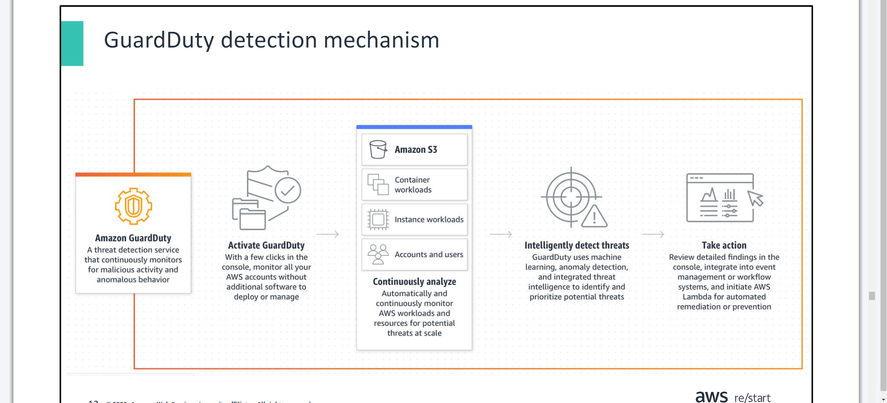
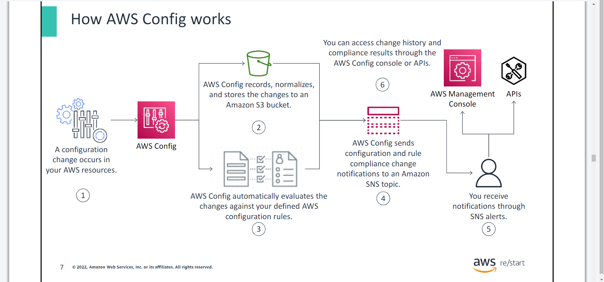

# Detection && AWS CloudTrail && AWS Config
- ***Day 1 Monday***

# Detection
- You will learn how to:

>> Describe how antivirus software is used to detect threats

>> Define the benefits of an intrusion detection system (IDS)

>> Identify how Amazon GuardDuty detects threats

## Antivirus software
- ***Antivirus software is a specialized program that prevents, detects, and removes malware.***

## Intrusion Detection System (IDS)
- ***An IDS detects security threats and generates alerts.***

## Amazon GuardDuty
## GuardDuty detection mechanism

- `GuardDuty` detects unauthorized and unexpected activity in your AWS environment by analyzing and processing data from different AWS service logs. These logs include the following:

>> AWS CloudTrail event logs

>> Virtual private cloud (VPC) flow logs•Domain Name System (DNS) logs

## GuardDuty findings example

# AWS CloudTrail
- You will learn how to:

>> Describe the value of AWS CloudTrail

>> Highlight the features of AWS CloudTrail

## Introduction to CloudTrail
## What is CloudTrail?
- CloudTrail provides auditing, security monitoring, and operational troubleshooting.

## CloudTrail benefits

## 

# AWS Config
- You will learn how to:

>> Highlight the features of AWS Config

>> Describe how AWS Config helps improve security configuration and compliance

## Security configuration challenge

## AWS Config explained

- `AWS Config` is used for the following:

1. Compliance auditing
2. Security analysis
3. Resource change tracking
4. Troubleshooting

## How AWS Config Works?

## AWS Config Rules

## 